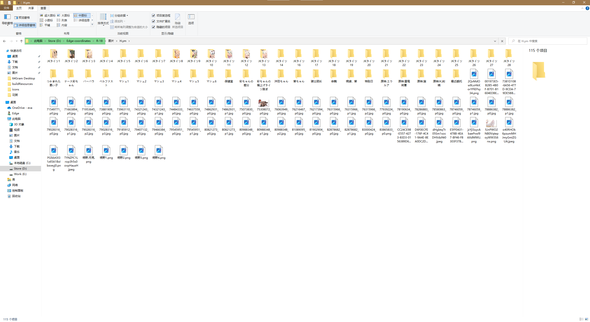

# WViewer 瀑布流图片查看器

**瀑布流**图片查看器，可以遍历文件夹和所有子文件夹并读取其中的全部图片，对于每个文件夹下的图片**按照名称排序**展示。
如果图片过多，会按照 定制数量（默认40张图片）/一页进行拆分，支持页面跳转，翻页。

## 适用范围

当看画师图包的时候，很有可能会碰到这种情况：

- 非常多的子文件夹，每个子文件夹中图片又不是很多。图片看起来，很不能尽兴。
- 同时，文件浏览器哪怕是**超大图标**，浏览起来仍然让人不很舒服。
- 想要放大查看某张图片，需要调用图片查看器程序，比较麻烦。
- 使用第三方查看软件，需要复制建库，持续添加…… 但是我只是想浏览一下这个文件夹的图片啊？

**于是，本软件诞生以解决您的所有需求！！！**

具体请查看[使用示例](#使用示例)

## 特性
- 💡 **展示所有**：递归遍历展示选择文件夹**及其所有子文件夹**中的图片，并按照名称排序展示。
- 🔑 **方便**： 直接拖入一个文件夹，即可查看图片，**0配置，0副作用**！！！
- ⚡ **快捷**： 可配置每一页展示的图片数量，以避免图片加载卡顿。
- 🦋 **瀑布流**：美观，大方
- ⌨️ **快捷键支持**：~~翻页快捷键~~，翻图片快捷键（均为 左右键）支持。
- 🛠️ **实用的图片查看器**：([photoswipe](https://github.com/dimsemenov/photoswipe))支持 图片查看的常规操作，放大，旋转，同样支持浏览上一张，下一张图片。
- 🖥️ **可设置**：支持定制 每页显示图片数量（当硬盘一般且单张图片过大时，建议选择较少的数量，10~20张比较不错），可设置图片筛选器（选定图片类型）……

## 警告

- 加载大量图片时可能会软件卡顿，这是电脑硬盘读取过慢造成的，耐心等待即可。
- 如果图片过大，硬盘性能不好，可能会造成加载浏览卡顿，这时候，建议使用固态硬盘，或者调小每一页展示的图片数量！！

## 使用示例

### 其一
**[TG preview link](https://t.me/edge_wasteland/6464)**
<!-- **[GIF preview link](https://postimg.cc/ctZfPV1q)** -->

### For NSFW Use
**[TG preview link](https://t.me/edge_wasteland/6465)**

## 致歉

因为本人时间原因（~~高三~~），个人能力有限（~~是个废物~~）。软件可能存在诸多问题，优化上也很烂，请诸位多多包涵，也欢迎大佬贡献代码。

## 最后

希望大家赏个**Star**，以满足吾辈这小小的虚荣心吧！！！

