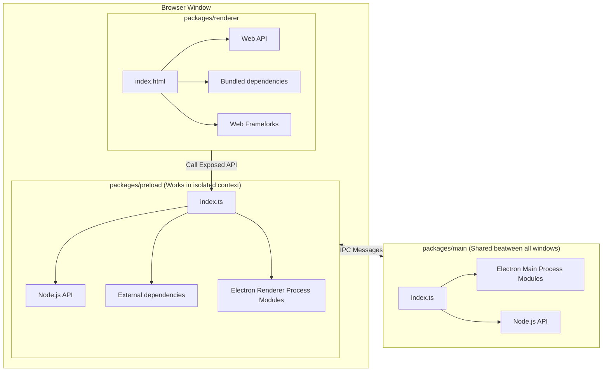
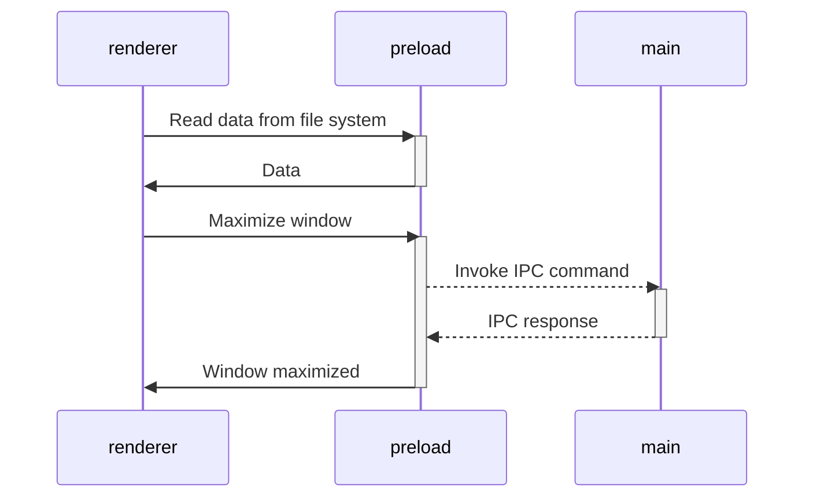

# Vite Electron Builder Boilerplate for SvelteKit

> [!NOTE]
> This is a [vite-electron-builder](https://github.com/cawa-93/vite-electron-builder) fork template for [SvelteKit app framework](https://kit.svelte.dev/). For the Svelte fork take a look at [Vite Electron Builder for Svelte](https://github.com/van100j/svelte-vite-electron-builder)


## Get started


### The easy way
You can start by clicking the **[Use this template](https://github.com/van100j/sveltekit-vite-electron-builder/generate)** button (you must be logged in) or just clone this repo.

### The harder way
Alternatively, and also to illustrate the steps taken to get to this fork, you can also do the following of the original [vite-electron-builder](https://github.com/cawa-93/vite-electron-builder):

1. Remove `packages/renderer` directory
  - Run `rm -rf packages/renderer`
2. Run `npm init vite` and follow the steps
  - For `Project name: ›` enter `packages/renderer`
  - For `Package name: ›` enter `svelte` (or whatever you wish)
  - For `Select a framework: ›` choose `Svelte`
  - For `Select a variant: ›` choose `SvelteKit`
  - For `Which Svelte app template?` choose `SvelteKit demo app` (or other is you wish)
  - For `Add type checking with TypeScript?` choose `Yes, using TypeScript syntax` (or other is you wish)
  - For `Select additional options` up to you (I selected all)

3. Run `npm install`
4. Get all devDependencies in `packages/renderer/package.json` and install them in the root dir
  - In my case `npm install @fontsource/fira-mono @neoconfetti/svelte @playwright/test @sveltejs/adapter-auto @sveltejs/kit @types/cookie @typescript-eslint/eslint-plugin @typescript-eslint/parser eslint eslint-config-prettier eslint-plugin-svelte prettier prettier-plugin-svelte svelte svelte-check tslib typescript vite vitest --save-dev`

5. SvelteKit is primarily designed for Server-Side Rendering (SSR). To make SvelteKit work with Electron we need to disable SSR and use `@sveltejs/adapter-static` to create a frontend based on Static-Site Generation (SSG).
  - Run `npm install --save-dev @sveltejs/adapter-static`

6. Update `packages/renderer/svelte.config.js` to use the static adapter, and make sure we use `dist` as a build directory
<details>

```js
import adapter from '@sveltejs/adapter-static';
import { vitePreprocess } from '@sveltejs/kit/vite';

/** @type {import('@sveltejs/kit').Config} */
const config = {
  // Consult https://kit.svelte.dev/docs/integrations#preprocessors
  // for more information about preprocessors
  preprocess: vitePreprocess(),

  kit: {
    adapter: adapter({
      // default options are shown. On some platforms
      // these options are set automatically — see below
      pages: 'dist',
      assets: 'dist',
      fallback: undefined,
      precompress: false,
      strict: true
    })
  }
};

export default config;
```

<summary>View code</summary>
</details>
<br>

7. Update `packages/renderer/vite.config.ts`:
<details>

```ts
import { sveltekit } from '@sveltejs/kit/vite';
import { defineConfig } from 'vite';
import {chrome} from '../../.electron-vendors.cache.json';
import {renderer} from 'unplugin-auto-expose';
import {join} from 'node:path';
import {injectAppVersion} from '../../version/inject-app-version-plugin.mjs';

const PACKAGE_ROOT = __dirname;

export default defineConfig({
  server: {
    fs: {
      // Allow serving files from one level up to the project root
      allow: ['../../'],
    },
  },
  build: {
    sourcemap: true,
    target: `chrome${chrome}`
  },
  plugins: [
    sveltekit(),
    renderer.vite({
      preloadEntry: join(PACKAGE_ROOT, '../preload/src/index.ts'),
    }),
    injectAppVersion(),
  ]
});
```

<summary>View code</summary>
</details>

<br>

8. Update `packages/renderer/vite.config.ts` with the following:
  <details>

```js
import { sveltekit } from '@sveltejs/kit/vite';
import { defineConfig } from 'vite';
import {chrome} from '../../.electron-vendors.cache.json';
import {renderer} from 'unplugin-auto-expose';
import {join} from 'node:path';
import {injectAppVersion} from '../../version/inject-app-version-plugin.mjs';

const PACKAGE_ROOT = __dirname;

export default defineConfig({
  server: {
    fs: {
      // Allow serving files from one level up to the project root
      allow: ['../../'],
    },
  },
  build: {
    sourcemap: true,
    target: `chrome${chrome}`,
    outDir: 'dist'
  },
        plugins: [
    sveltekit(),
    renderer.vite({
      preloadEntry: join(PACKAGE_ROOT, '../preload/src/index.ts'),
    }),
    injectAppVersion(),
  ]
});
  ```

  <summary>View code</summary>
  </details>

<br>

9. We need to disable SSR and enable prerendering by adding a root `packages/renderer/src/routes/+layout.ts` with the following:
```ts
export const prerender = true
export const ssr = false
```
- Additionally, if you've chosen to use `SvelteKit demo app` in step 2 make sure to delete `packages/renderer/src/routes/sverdle` or any other pages that use data loading (remember we're using a static adapter to generate a static site)

10. When developing, SvelteKit is pretty sensitive when it comes to the current directory — it needs to be its root so all the files generated in `.svelte-kit` directory are properly accessible. To make it happy, once we run `scripts/watch.mjs` with `npm run watch` the first thing we do is change the working directory to `packages/renderer` (alternatively, we could change directory in the npm `watch` script to `cd packages/renderer && node ../../scripts/watch.mjs`), and update the main's and preloader's Vite configuration with the appropriate paths:
<details>

```mjs
#!/usr/bin/env node

import {build, createServer} from 'vite';
import electronPath from 'electron';
import {spawn} from 'child_process';
import {fileURLToPath} from 'url';
import {join} from 'node:path';

process.chdir("packages/renderer")

const __dirname = fileURLToPath(new URL('.', import.meta.url))

/** @type 'production' | 'development'' */
const mode = (process.env.MODE = process.env.MODE || 'development');

/** @type {import('vite').LogLevel} */
const logLevel = 'warn';

/**
 * Setup watcher for `main` package
 * On file changed it totally re-launch electron app.
 * @param {import('vite').ViteDevServer} watchServer Renderer watch server instance.
 * Needs to set up `VITE_DEV_SERVER_URL` environment variable from {@link import('vite').ViteDevServer.resolvedUrls}
 */
function setupMainPackageWatcher({resolvedUrls}) {
  process.env.VITE_DEV_SERVER_URL = resolvedUrls.local[0];

  /** @type {ChildProcess | null} */
  let electronApp = null;

  return build({
    mode,
    logLevel,
    configFile: '../main/vite.config.js',
    build: {
      /**
       * Set to {} to enable rollup watcher
       * @see https://vitejs.dev/config/build-options.html#build-watch
       */
      watch: {},
    },
    plugins: [
      {
        name: 'reload-app-on-main-package-change',
        writeBundle() {
          /** Kill electron if process already exist */
          if (electronApp !== null) {
            electronApp.removeListener('exit', process.exit);
            electronApp.kill('SIGINT');
            electronApp = null;
          }

          /** Spawn new electron process */
          electronApp = spawn(String(electronPath), ['--inspect', '.'], {
            stdio: 'inherit',
            cwd: join(__dirname, '../')
          });

          /** Stops the watch script when the application has been quit */
          electronApp.addListener('exit', process.exit);
        },
      },
    ],
  });
}

/**
 * Setup watcher for `preload` package
 * On file changed it reload web page.
 * @param {import('vite').ViteDevServer} watchServer Renderer watch server instance.
 * Required to access the web socket of the page. By sending the `full-reload` command to the socket, it reloads the web page.
 */
function setupPreloadPackageWatcher({ws}) {
  return build({
    mode,
    logLevel,
    configFile: '../preload/vite.config.js',
    build: {
      /**
       * Set to {} to enable rollup watcher
       * @see https://vitejs.dev/config/build-options.html#build-watch
       */
      watch: {},
    },
    plugins: [
      {
        name: 'reload-page-on-preload-package-change',
        writeBundle() {
          ws.send({
            type: 'full-reload',
          });
        },
      },
    ],
  });
}

/**
 * Dev server for Renderer package
 * This must be the first,
 * because the {@link setupMainPackageWatcher} and {@link setupPreloadPackageWatcher}
 * depend on the dev server properties
 */
const rendererWatchServer = await createServer({
  mode,
  logLevel,
}).then(s => s.listen());

await setupPreloadPackageWatcher(rendererWatchServer);
await setupMainPackageWatcher(rendererWatchServer);

```

<summary>View code</summary>
</details>

<br>

11. With SvelteKit we are generating multiple pages (routes) with their own resources, and in order to make sure we can switch between and properly access these pages we need to `serve` the `dist` directory instead of just loading a single html file with `browserWindow.loadFile(...)`. We can use [electron-serve](https://github.com/sindresorhus/electron-serve) for this, and update the `packages/main/src/mainWindow.ts` accordingly:
  - Run `npm install electron-serve`
<details>

```ts
import {app, BrowserWindow} from 'electron';
import {join, resolve} from 'node:path';
import serve from 'electron-serve';

const loadURL = serve({directory: join(app.getAppPath(), 'packages/renderer/dist')});

async function createWindow() {
  const browserWindow = new BrowserWindow({
    show: false, // Use the 'ready-to-show' event to show the instantiated BrowserWindow.
    webPreferences: {
      nodeIntegration: false,
      contextIsolation: true,
      sandbox: false, // Sandbox disabled because the demo of preload script depend on the Node.js api
      webviewTag: false, // The webview tag is not recommended. Consider alternatives like an iframe or Electron's BrowserView. @see https://www.electronjs.org/docs/latest/api/webview-tag#warning
      preload: join(app.getAppPath(), 'packages/preload/dist/index.cjs'),
    },
  });

  /**
   * If the 'show' property of the BrowserWindow's constructor is omitted from the initialization options,
   * it then defaults to 'true'. This can cause flickering as the window loads the html content,
   * and it also has show problematic behaviour with the closing of the window.
   * Use `show: false` and listen to the  `ready-to-show` event to show the window.
   *
   * @see https://github.com/electron/electron/issues/25012 for the afford mentioned issue.
   */
  browserWindow.on('ready-to-show', () => {
    browserWindow?.show();

    if (import.meta.env.DEV) {
      browserWindow?.webContents.openDevTools();
    }
  });

  /**
   * Load the main page of the main window.
   */
  if (import.meta.env.DEV && import.meta.env.VITE_DEV_SERVER_URL !== undefined) {
    /**
     * Load from the Vite dev server for development.
     */
    await browserWindow.loadURL(import.meta.env.VITE_DEV_SERVER_URL);
  } else {
    /**
     * Load from the local file system for production and test.
     *
     * Use BrowserWindow.loadFile() instead of BrowserWindow.loadURL() for WhatWG URL API limitations
     * when path contains special characters like `#`.
     * Let electron handle the path quirks.
     * @see https://github.com/nodejs/node/issues/12682
     * @see https://github.com/electron/electron/issues/6869
     */
    // await browserWindow.loadFile(resolve(__dirname, '../../renderer/dist/index.html'));
    await loadURL(browserWindow);
  }

  return browserWindow;
}

/**
 * Restore an existing BrowserWindow or Create a new BrowserWindow.
 */
export async function restoreOrCreateWindow() {
  let window = BrowserWindow.getAllWindows().find(w => !w.isDestroyed());

  if (window === undefined) {
    window = await createWindow();
  }

  if (window.isMinimized()) {
    window.restore();
  }

  window.focus();
}

```

<summary>View code</summary>
</details>

<br>

12. Start developing, building, compiling...
  - Run `npm run watch`
  - Run `npm run build`
  - Run `npm run compile`

<br>

> 👇 The original [vite-electron-builder](https://github.com/cawa-93/vite-electron-builder) readme

[](https://stand-with-ukraine.pp.ua)

---

# Vite Electron Builder Boilerplate

This is a template for secure electron applications. Written following the latest safety requirements, recommendations
and best practices.

Under the hood is [Vite] — A next-generation blazing fast bundler, and [electron-builder] for packaging.

## Get started

Follow these steps to get started with the template:

1. Click the **[Use this template](https://github.com/cawa-93/vite-electron-builder/generate)** button (you must be
   logged in) or just clone this repo.
2. If you want to use another package manager you may need to edit [`.github/workflows`](https://github.com/search?q=npm+repo%3Acawa-93%2Fvite-electron-builder+path%3A.github%2Fworkflows&type=Code) since npm is used as default. (See also https://github.com/cawa-93/vite-electron-builder/issues/944)
   > **Note**:
   > This template configured to install `peerDependencies` automatically.


That's all you need. 😉

❤️ **If you like this template, don't forget to give a ⭐ or [send support](https://www.buymeacoffee.com/kozack/)!** 


## Features

### Electron [][electron]

- This template uses the latest electron version with all the latest security patches.
- The architecture of the application is built according to the
  security [guides](https://www.electronjs.org/docs/tutorial/security) and best practices.
- The latest version of the [electron-builder] is used to package the application.

### Vite [][vite]

- [Vite] is used to bundle all source codes. It's an extremely fast bundler, that has a vast array of amazing features.
  You can learn more about how it is arranged in [this](https://www.youtube.com/watch?v=xXrhg26VCSc) video.
- Vite [supports](https://vitejs.dev/guide/env-and-mode.html) reading `.env` files. You can also specify the types of
  your environment variables in [`types/env.d.ts`](types/env.d.ts).
- Automatic hot-reloads for the `Main` and `Renderer` processes.

Vite provides many useful features, such as: `TypeScript`, `TSX/JSX`, `CSS/JSON Importing`, `CSS Modules`
, `Web Assembly` and much more.

> [See all Vite features](https://vitejs.dev/guide/features.html).

### TypeScript [][typescript] (optional)

- The latest version of TypeScript is used for all the source code.
- **Vite** supports TypeScript out of the box. However, it does not support type checking.
- Code formatting rules follow the latest TypeScript recommendations and best practices thanks
  to [@typescript-eslint/eslint-plugin](https://www.npmjs.com/package/@typescript-eslint/eslint-plugin).

> [Guide to disable typescript and remove dependencies](https://github.com/cawa-93/vite-electron-builder/discussions/339) 

### Vue [][vue] (optional)

- By default, web pages are built using [Vue]. However, you can easily change that. Or not use additional frameworks at
  all.
- Code formatting rules follow the latest Vue recommendations and best practices thanks to [eslint-plugin-vue].

> [Find more forks 🔱 for others frameworks or setups](https://github.com/cawa-93/vite-electron-builder/discussions/categories/forks)

### Continuous Integration

- The configured workflow will check the types for each push and PR.
- The configured workflow will check the code style for each push and PR.
- **Automatic tests**
  used [Vitest ][vitest]
  -- A blazing fast test framework powered by Vite.
  - Unit tests are placed within each package and are ran separately.
  - End-to-end tests are placed in the root [`tests`](tests) directory and use [playwright].


### Publishing

- Each time you push changes to the `main` branch, the [`release`](.github/workflows/release.yml) workflow starts, which creates a new draft release. For each next commit will be created and replaced artifacts. That way you will always have draft with latest artifacts, and the release can be published once it is ready. 
  - Code signing supported. See [`release` workflow](.github/workflows/release.yml).
  - **Auto-update is supported**. After the release is published, all client applications will download the new version
  and install updates silently.
  
> **Note**:
> This template **configured only for GitHub public repository**, but electron-builder also supports other update distribution servers. Find more in [electron-builder docs](https://www.electron.build/configuration/publish).

## How it works

The template requires a minimum amount [dependencies](package.json). Only **Vite** is used for building, nothing more.

### Project Structure

The structure of this template is very similar to a monorepo. The entire source code of the project is divided into three modules (packages) that are each bundled independently:

- [`packages/renderer`](packages/renderer). Responsible for the contents of the application window. In fact, it is a
  regular web application. In developer mode, you can even open it in a browser. The development and build process is
  the same as for classic web applications. Access to low-level API electrons or Node.js is done through the _preload_
  layer.
- [`packages/preload`](packages/preload). Contain Electron [**preload scripts**](https://www.electronjs.org/docs/latest/tutorial/tutorial-preload). Acts as an intermediate bridge between the _renderer_ process and the API
  exposed by electron and Node.js. Runs in an _isolated browser context_, but has direct access to the full Node.js
  functionality.
- [`packages/main`](packages/main)
  Contain Electron [**main script**](https://www.electronjs.org/docs/tutorial/quick-start#create-the-main-script-file). This is
  the main process that powers the application. It manages creating and handling the spawned BrowserWindow, setting and
  enforcing secure permissions and request handlers. You can also configure it to do much more as per your need, such
  as: logging, reporting statistics and health status among others.

Schematically, the structure of the application and the method of communication between packages can be depicted as follows:

### Build web resources

The `main` and `preload` packages are built in [library mode](https://vitejs.dev/guide/build.html#library-mode) as it is
simple javascript.
The `renderer` package builds as a regular web app.

### Compile App

The next step is to package a ready to distribute Electron app for macOS, Windows and Linux with "auto update" support
out of the box.

To do this, use [electron-builder]:

- Using the npm script `compile`: This script is configured to compile the application as quickly as possible. It is not
  ready for distribution, it is compiled only for the current platform and is used for debugging.
- Using GitHub Actions: The application is compiled for any platform and ready-to-distribute files are automatically
  added as a draft to the GitHub releases page.

### Working with dependencies

Because the `renderer` works and builds like a _regular web application_, you can only use dependencies that support the
browser or compile to a browser-friendly format.

This means that in the `renderer` you are free to use any frontend dependencies such as Vue, React, lodash, axios and so
on. However, you _CANNOT_ use any native Node.js APIs, such as, `systeminformation`. These APIs are _only_ available in
a Node.js runtime environment and will cause your application to crash if used in the `renderer` layer. Instead, if you
need access to Node.js runtime APIs in your frontend, export a function form the `preload` package.

All dependencies that require Node.js api can be used in
the [`preload` script](https://www.electronjs.org/docs/latest/tutorial/process-model#preload-scripts).

#### Expose in main world
Here is an example. Let's say you need to read some data from the file system or database in the renderer.

In the preload context, create a function that reads and returns data. To make the function announced in the preload
available in the render, you usually need to call
the [`electron.contextBridge.exposeInMainWorld`](https://www.electronjs.org/ru/docs/latest/api/context-bridge). However,
this template uses the [unplugin-auto-expose](https://github.com/cawa-93/unplugin-auto-expose) plugin, so you just need
to export the method from the preload. The `exposeInMainWorld` will be called automatically.

```ts
// preload/index.ts
import { readFile } from 'node:fs/promises';

// Encapsulate types if you use typescript
interface UserData {
  prop: string
}

// Encapsulate all node.js api
// Everything you exported from preload/index.ts may be called in renderer
export function getUserData(): Promise<UserData> {
  return readFile('/path/to/file/in/user/filesystem.json', {encoding:'utf8'}).then(JSON.parse);
}
```

Now you can import and call the method in renderer

```ts
// renderer/anywere/component.ts
import { getUserData } from '#preload'
const userData = await getUserData()
```

> Find more in [Context Isolation tutorial](https://www.electronjs.org/docs/tutorial/context-isolation#security-considerations).

### Working with Electron API

Although the preload has access to all of Node.js's API, it **still runs in the BrowserWindow context**, so a limited
electron modules are available in it. Check the [electron docs](https://www.electronjs.org/ru/docs/latest/api/clipboard)
for full list of available methods.

All other electron methods can be invoked in the `main`.

As a result, the architecture of interaction between all modules is as follows:



> Find more in [Inter-Process Communication tutorial](https://www.electronjs.org/docs/latest/tutorial/ipc).

### Modes and Environment Variables

All environment variables are set as part of the `import.meta`, so you can access them vie the following
way: `import.meta.env`.

> **Note**:
> If you are using TypeScript and want to get code completion you must add all the environment variables to
the [`ImportMetaEnv` in `types/env.d.ts`](types/env.d.ts).

The mode option is used to specify the value of `import.meta.env.MODE` and the corresponding environment variables files
that need to be loaded.

By default, there are two modes:

- `production` is used by default
- `development` is used by `npm run watch` script

When running the build script, the environment variables are loaded from the following files in your project root:

```
.env                # loaded in all cases
.env.local          # loaded in all cases, ignored by git
.env.[mode]         # only loaded in specified env mode
.env.[mode].local   # only loaded in specified env mode, ignored by git
```

> **Warning**: 
> To prevent accidentally leaking env variables to the client, only variables prefixed with `VITE_` are exposed to your
Vite-processed code.

For example let's take the following `.env` file:

```
DB_PASSWORD=foobar
VITE_SOME_KEY=123
```

Only `VITE_SOME_KEY` will be exposed as `import.meta.env.VITE_SOME_KEY` to your client source code, but `DB_PASSWORD`
will not.

You can change that prefix or add another. See [`envPrefix`](https://vitejs.dev/config/shared-options.html#envprefix)

## Contribution

See [Contributing Guide](contributing.md).


[vite]: https://github.com/vitejs/vite/

[electron]: https://github.com/electron/electron

[electron-builder]: https://github.com/electron-userland/electron-builder

[vue]: https://github.com/vuejs/vue-next

[vue-router]: https://github.com/vuejs/vue-router-next/

[typescript]: https://github.com/microsoft/TypeScript/

[playwright]: https://playwright.dev

[vitest]: https://vitest.dev

[vue-tsc]: https://github.com/johnsoncodehk/vue-tsc

[eslint-plugin-vue]: https://github.com/vuejs/eslint-plugin-vue

[cawa-93-github]: https://github.com/cawa-93/

[cawa-93-sponsor]: https://www.patreon.com/Kozack/
